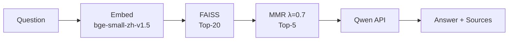
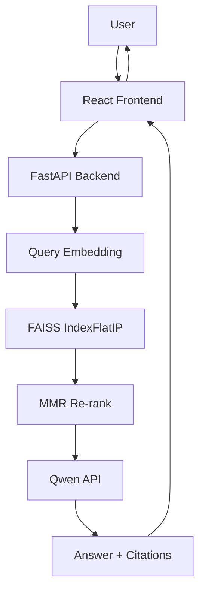

<div align="center">

# Yuti RAG

**Multi-KB RAG QA System for Yunnan's Intangible Cultural Heritage**  
Built with FAISS + MMR re-ranking + LLM generation.

[](https://www.python.org/downloads/)
[](https://fastapi.tiangolo.com/)
[](https://react.dev/)
[](LICENSE)
[](.github/workflows/ci.yml)

</div>

---

## Overview

Yuti RAG answers questions about Yunnan's intangible cultural heritage across **10 isolated knowledge bases** (Dongba hieroglyphs, Pu'er tea, tie-dye, Torch Festival, etc.). Each KB has its own vector index, so retrieval is domain-precise.

The key differentiator is **MMR re-ranking** — instead of returning the most-similar Top-5 chunks (which often cluster around one document), MMR balances relevance with diversity so answers draw from multiple sources.



## Features

- **Multi-KB isolation** — each KB has its own FAISS index, metadata, and search
- **MMR quality** — `MMR = λ·sim(q,d) − (1−λ)·max sim(d_i,d_j)` reduces redundancy
- **Traceable answers** — every response cites source documents with relevance scores
- **Full KB management** — create, upload, search, delete via UI or REST API
- **Persistent sessions** — conversation history across 20 rounds context window
- **Dark/light theme** — modern glassmorphism UI (React 18 + TailwindCSS + Framer Motion)

## Quick Start (3 steps)

```bash
# 1. Install
pip install -r requirements.txt
cd frontend && npm install && cd ..

# 2. Configure + build
cp .env.example .env    # edit with your DASHSCOPE_API_KEY
cd backend && python build_index.py && cd ..

# 3. Start
python -m uvicorn backend.main:app --reload --port 8001  # terminal 1
cd frontend && npm run dev                                 # terminal 2
```

Open http://localhost:5174

### Docker

```bash
cp .env.example .env   # edit your key
docker compose up -d
```

## Architecture



## RAG Evaluation Summary

| Metric | Result | Notes |
|--------|--------|-------|
| Embedding dimension | 512 | BAAI/bge-small-zh-v1.5 |
| Chunk size / overlap | 500 / 100 chars | Paragraph-aware, sliding window for long text |
| FAISS coarse search | Top-20 | IndexFlatIP, cosine similarity |
| MMR re-rank | Top-5 (λ=0.7) | Balances 70% relevance + 30% diversity |
| Recall failure fallback | Score < 0.40 → "no relevant info" | Prevents hallucination on out-of-domain queries |
| MMR diversity improvement | Confirmed | Lower λ → measurably lower pairwise similarity |
| CI test suite | 42 tests passing | chunker, loader, retriever, history, API |

## API

| Method | Path | Description |
|--------|------|-------------|
| POST | `/api/chat` | Ask a question against a knowledge base |
| GET | `/api/kb/list` | List all knowledge bases |
| GET | `/api/kb/{name}/info` | KB details + document list |
| POST | `/api/kb/build` | Build/rebuild a KB vector index |
| POST | `/api/kb/{name}/upload` | Upload documents |
| DELETE | `/api/kb/{name}` / `.../documents/{file}` | Delete KB or document |
| GET | `/api/history` | Get conversation history |
| POST | `/api/feedback` | Record thumbs up/down |

Interactive docs at http://localhost:8001/docs

## Stack

| Layer | Technology |
|-------|-----------|
| Backend | Python 3.11, FastAPI, Uvicorn |
| Search | FAISS (IndexFlatIP), sentence-transformers |
| LLM | Qwen API (OpenAI-compatible) |
| Frontend | React 18, TypeScript, Vite, TailwindCSS, Framer Motion |
| Documents | PyPDF2, python-docx |
| Testing | pytest (42 tests, CI via GitHub Actions) |
| Deployment | Docker, docker-compose |

## Project Structure

```
backend/           → FastAPI routes + RAG pipeline modules
frontend/          → React app (TypeScript)
knowledge_bases/   → 10 curated KBs (tracked)
tests/             → 42 integration + unit tests
Dockerfile         → containerized backend
docker-compose.yml → one-command startup
```

## License

MIT — see [LICENSE](LICENSE).
